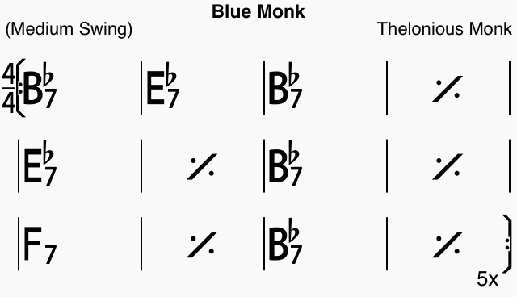

# Chord collab

React application to collaborate on chords charts.

## Getting started commands

In the project directory, you can run:

### `npm start`

### `npm test`

### `npm run build`

## What does it do?

The app is supposed to read and write chord chart files in iRealPro format.
The specification for this format can be found here: https://www.irealpro.com/ireal-pro-file-format

A module to do this could be: https://github.com/pianosnake/ireal-reader

An example rendered song:

